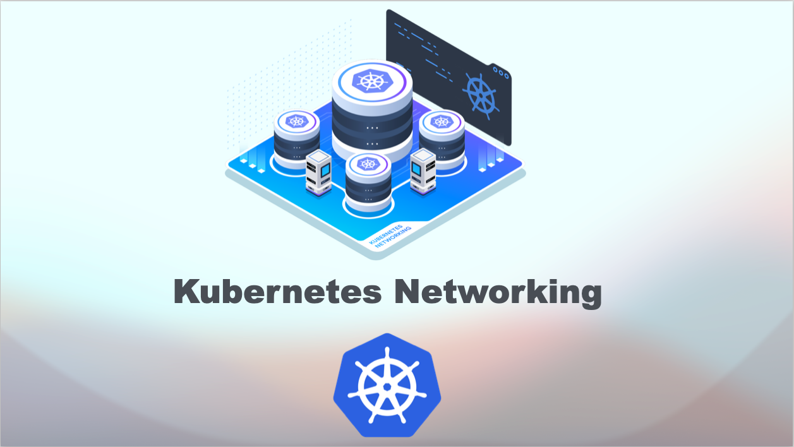

# 🚀 Kubernetes Networking Demonstration
[](https://www.linkedin.com/in/aman-devops/)

[](https://www.youtube.com/watch?v=7X9Gj3nI73o&t=628s)




Welcome to the repository for **demonstrating kubernetes networking**!

## 🌟 Overview
This project covers:
- **Kubernetes different types of networking**
- **Setup Kubernetes Network**

## 🌟 Comprehensive Guide
For a detailed guide, please refer to my [Youtube video](https://medium.com/p/c046e8d44865).

## Slides

Slide 1            | Slide 2         | Slide 3        | Slide 4
:------------------------:|:-----------------------:|:----------------------:|:----------------------:
  |  |  | 

## 🌟 Useful Commands
### Install Calico

```
kubectl apply -f https://docs.projectcalico.org/manifests/calico.yaml
```

### Enable External Access Using Ingress

```
kubectl apply -f https://raw.githubusercontent.com/kubernetes/ingress-nginx/main/deploy/static/provider/cloud/deploy.yaml
```

Happy learning 📚


